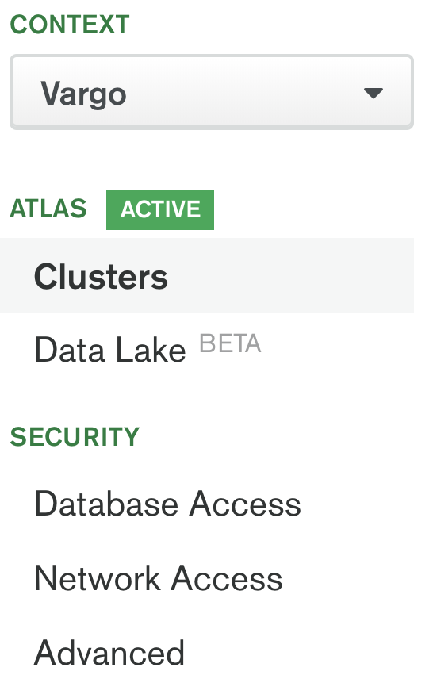
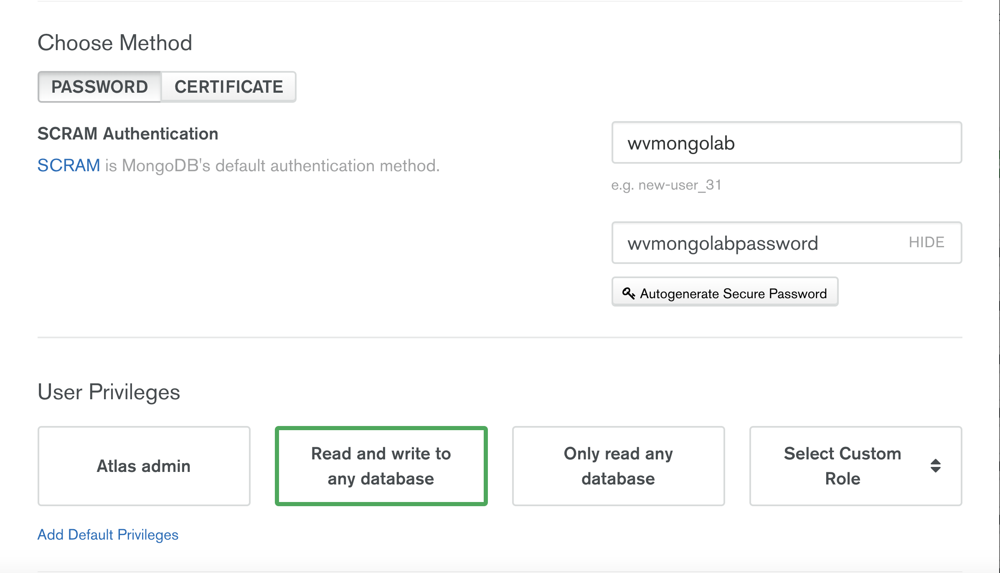
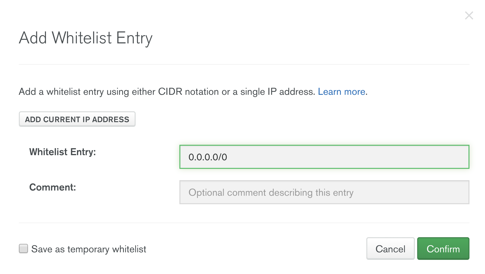

# wvmongolab
Simple Mongo app to display movie data based on Atlas sample data.

Note: This app does not display proper connection handling for a NodeJS/MongoDB application. Currently initiates and closes a connection to Mongo for each HTTP call. This is due to laziness and a desire to keep this application simple. 

## Requirements
- nodejs
- npm
- git
- MongoDB Atlas account (created for free at cloud.mongodb.com)

## Installation 
- Clone this repo using the following command:
`git clone https://github.com/MongoWinston/wvmongolab.git`
- In the project directory, run `npm install`

## Set Up App
- If you have not done this, create an Atlas cluster (for free) at cloud.mongodb.com. An M0 free tier cluster is fine for this small app. This does not require a credit card.
- Make sure the Atlas cluster has an associated username/password and ip whitelist (doesn't have to be 0.0.0.0/0 but that is easiest). These options can be found in the context menu on the left of the Atlas UI under `Database Access` and `Network Access`.

- To create a user, select the `Database Access` option in the left context menu and at the top right of that page will be a `NEW USER` button. Select that create a new user with the proper level of access. "Read and write to any database" is easiest. REMEMBER YOUR PASSWORD!

- To whitelist IP address, select the `Network Access` option in the left context menu. At the top right there will be an `ADD IP ADDRESS` button. Click that and either whitelist your current IP or 0.0.0.0/0

- Once an Atlas cluster is provisioned, load sample data as shown:

- In the Atlas console, click on the `Connnect` button, and select the `Connect Your Application` option. Make sure you have `Node.js`, version `3.0 or later` as your driver version, and click on the `Copy` button for `Connection String Only`

- Edit .env file in the root of the node project with that Atlas generated connection string, as well as the username and password of the user you created in the Atlas UI.

## Run App
- Go to the root folder in the terminal and type `npm run start`
- Open your favorite browser and navigate to `localhost:3000`
